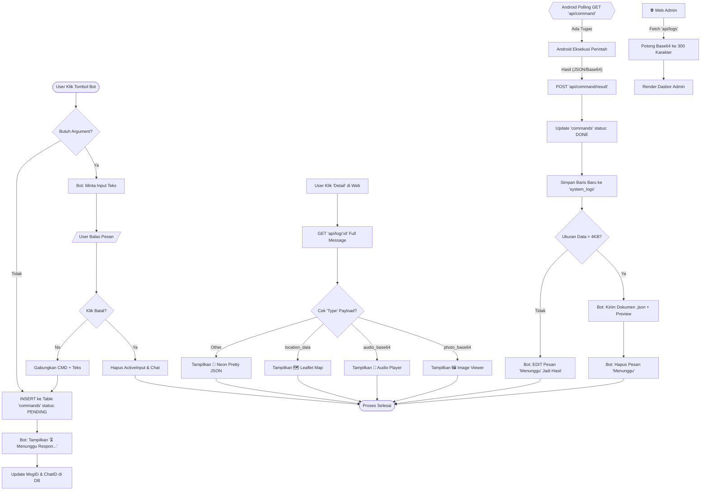

# Diagram Logika RAC-JS (Logic Flowchart)

Diagram ini merinci setiap langkah logika mulai dari inisiasi perintah di Telegram hingga penampilan hasil multimedia di Web Admin.

---

### Key Logic Features Implemented:
*   **Active Input Handler**: Menggunakan objek `activeInput` di memori NodeJS untuk mengaitkan balasan teks pengguna dengan perintah yang tertunda.
*   **Anti-Spam (Smart Edit)**: Sistem melacak `message_id` sejak awal. Jika hasil kecil, pesan "Menunggu" dipoles (diedit); jika besar, pesan "Menunggu" dibuang agar tidak menumpuk.
*   **Multimedia Stream (Base64 Isolation)**: Data gambar/suara besar tidak dimuat saat rendering tabel utama (SUBSTR 300) guna menjaga kinerja memori browser tetap stabil.
*   **SQLite Synchronization**: Menggunakan ID unik yang sama antara tabel `commands` dan `system_logs` untuk memastikan integritas data dari awal hingga akhir.
